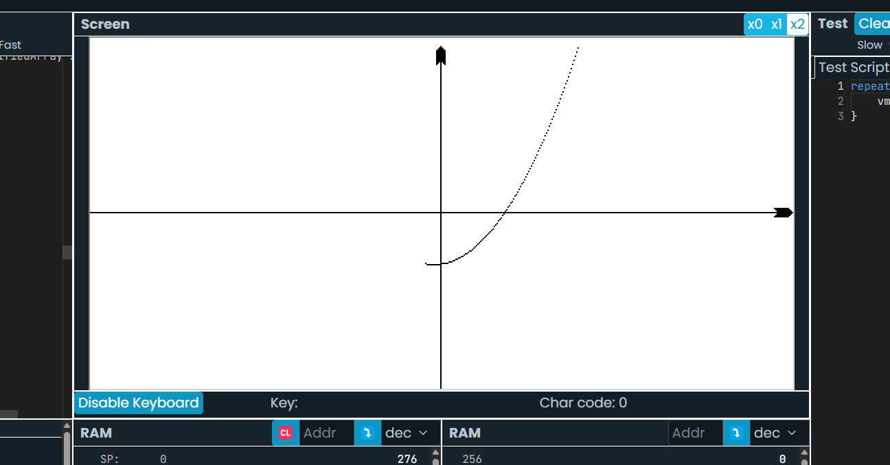
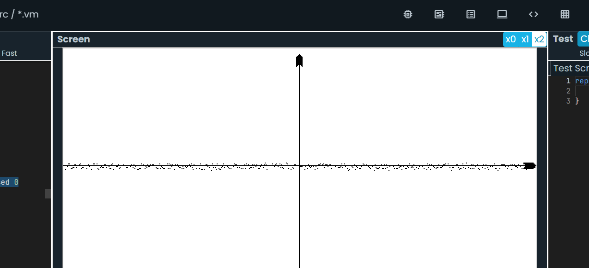

Сразу напишу, в целом проет интересный, выпполнено хорошо, но всё же есть немного недочетов

1)При тесте
Иногда при приближении часть графика перестаёт отрисовываться

Было бы отлично если бы при движении графика оси координат двигалась за ним, ну к примеру чтобы можно было приблизить и посмотреть значение в точке с x = 0(ну образно, цифр же нет)

Возможно стоит что то сделать с большими числами, а то график при степени 3 рисует космос, а если ставить больше, то он вообще постепенно становится линией

2)Смотрим код

Calculator:
17 строка - нейминг

IntList,CharList,StringList:
проигнорируйте если невозможно, но если возможно классно было бы сделать один лист для любых элементов

Parser:
parse не используется

StringMethods:
Сontains и Сount покрывают только частные случаи, которых у вас не будет(я про то что метод не работает для любых строк), возможно с остальными методами там так же. Не знаю насколько это плохо но мне нечего написать, так что пусть будет:)

3)Подытожу
Проект шикарный, реализовали всё, что надо было и даже больше, код хороший, красивый везде, всё отлично, МОЛОДЦЫ.